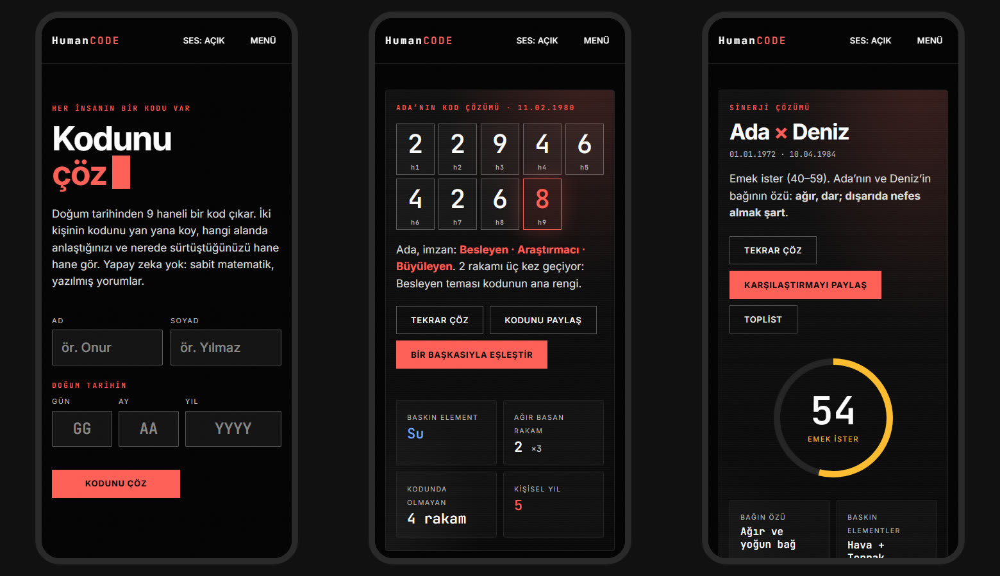
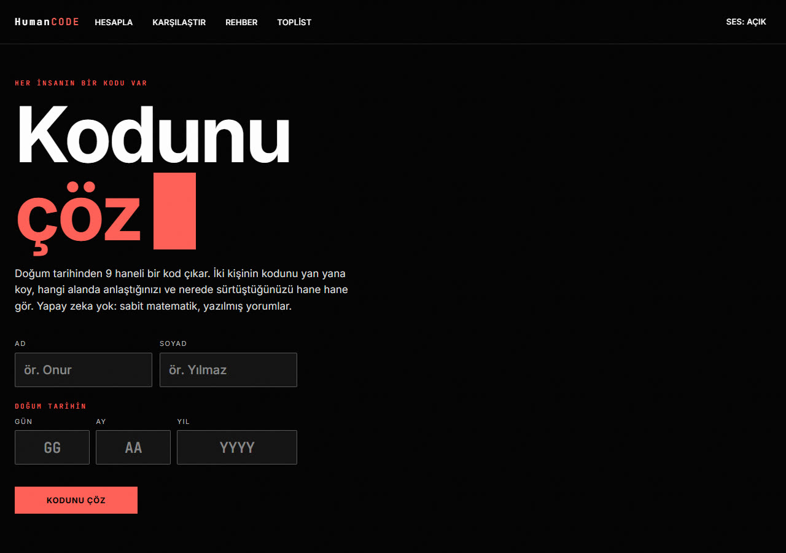
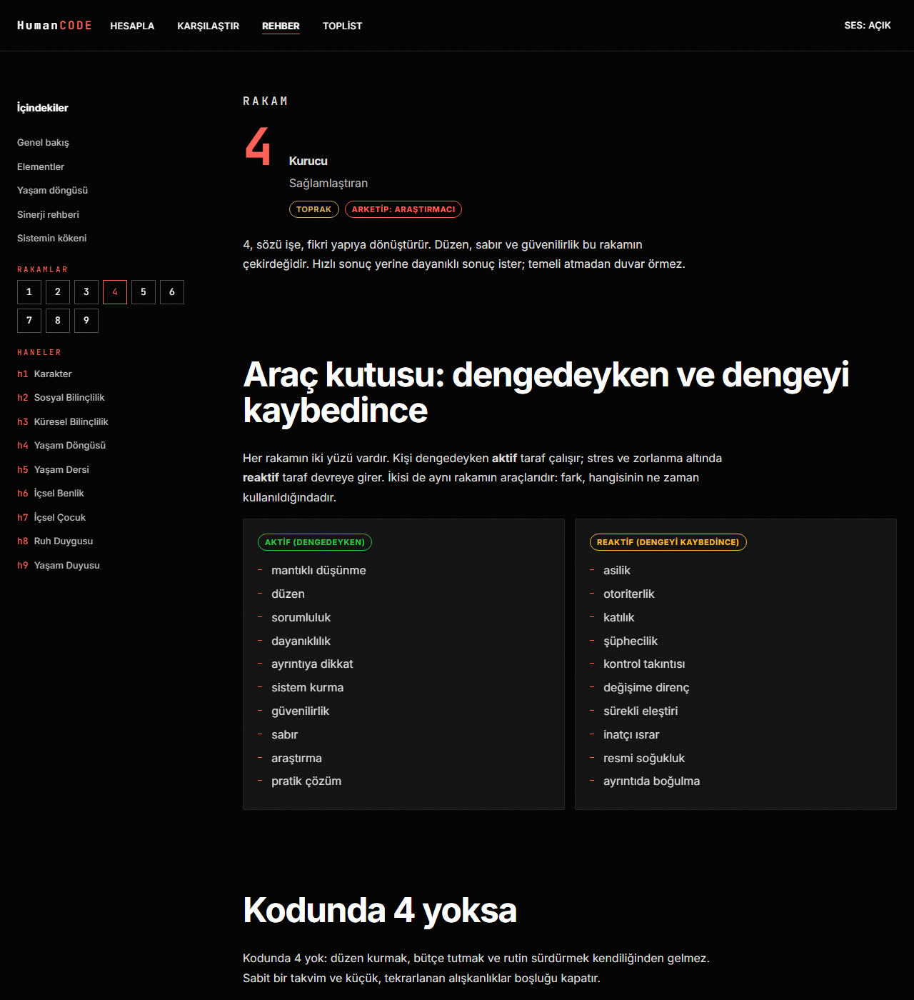
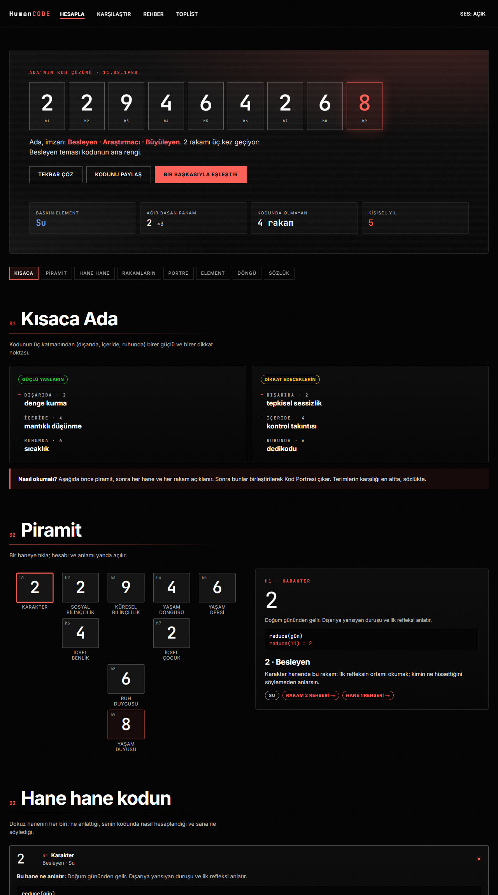
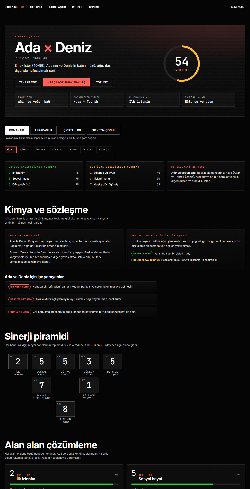

<div align="center">

# HumanCODE

**Decode your birth date into a 9-digit code. Compare two people, area by area.**
No AI, no randomness: fixed maths and hand-written interpretations.

🌐 **English** · [Türkçe](README.tr.md) &nbsp;|&nbsp; 🔗 **[Live site](https://humanpin.vercel.app)**




</div>

> ⚠️ **Proprietary project.** © 2026 **Onur Teryakioğlu**. All rights reserved. The source is visible for evaluation only:
> you may **not** copy, fork for reuse, host, modify, redistribute, sell, present it as your own, or use it to train AI models.
> See [LICENSE](LICENSE) ([Türkçe](LICENSE.tr.md)).

---

## What it is

HumanCODE turns a birth date into a **9-digit code** (a pyramid of nine "houses"), explains every digit, and compares
two people across **eight life areas** with a fully deterministic score. The interface is in Turkish; the repository
documentation is bilingual.

| | |
|---|---|
| 🔢 **Code decoding** | Day, month, year → 9 digits, element balance, life cycle, personal year |
| 💞 **Synergy** | Two codes → an 8-digit synergy pyramid, a 0–100 compatibility score and area-by-area readings written with the people's **names** |
| 🧬 **Portrait** | Deterministic "code portrait": outer vs inner self, recurring lessons, dominant and missing digits |
| 📖 **Guide** | 9 digit pages, 9 house pages, elements, life cycles, synergy guide, sources and limits |
| 🏆 **Top list** | Every comparison is added automatically, sorted by score. Names are censored (`On*** Yı***`) |
| 🟢 **Live counter** | The number of people online falls through the Matrix rain in the background |
| 🎬 **Decode scene** | Full-screen Matrix-style reveal with sound (skippable, respects `prefers-reduced-motion`) |

## Screenshots

<table>
<tr>
<td width="50%"><br><sub><b>Home</b>: name, surname, date of birth</sub></td>
<td width="50%"><br><sub><b>Guide</b>: every digit explained</sub></td>
</tr>
<tr>
<td colspan="2"><br><sub><b>Code result</b>: hero, quick summary, interactive pyramid, house-by-house cards</sub></td>
</tr>
<tr>
<td colspan="2"><br><sub><b>Compatibility</b>: score ring, chemistry and contract, synergy pyramid, area cards (demo names)</sub></td>
</tr>
</table>

## Design principles

- **Deterministic.** Same input → same output, always. No LLM/AI calls, no `Math.random()` in the readings.
  Text variety comes from rules (digit counts, missing digits, element relations) and a seeded picker.
- **Mathematically checked.** All formulas are unit-tested against hand-verified vectors (see below).
- **Mobile first.** Touch-safe (`touch-action: manipulation`, ≥ 44 px targets), safe-area aware, installable as a PWA,
  no horizontal overflow at 345 px, click sounds fire on real taps only (not while scrolling).
- **Fast.** Result pages are rendered on the server; only the interactive parts hydrate. Lighthouse (mobile) 92+.
- **Honest.** Numerology is not science. Every result carries a disclaimer, each area has an optional *science note*
  with real psychology findings (which do **not** validate numerology), and the guide has a "scientific status" section.
- **Privacy-minded.** Calculations run in the browser. Only censored names, scores and codes reach the top list; full names
  and birth dates are never stored.

## How the maths works

`reduce(n)`: while `n > 9`, sum its digits (`29 → 11 → 2`). No master numbers.

| House | Formula |
|---|---|
| h1 Character | `reduce(day)` |
| h2 Social consciousness | `reduce(month)` |
| h3 Global consciousness | `reduce(sum of year digits)` |
| h4 Life cycle | `reduce(h1 + h2 + h3)` |
| h5 Life lesson | `reduce(h1 + h4)` |
| h6 Inner self | `reduce(h1 + h2)` |
| h7 Inner child | `reduce(h2 + h3)` |
| h8 Sense of spirit | `reduce(h6 + h7)` |
| h9 Life sense | `reduce(h1 + … + h8)` |

**Synergy:** `sHn = reduce(A.hn + B.hn)` for n = 1..8. **Score:**
`round(0.60 · sH8 points + 0.25 · element points + 0.15 · sH1 points)`, computed in integer arithmetic (no floating-point
rounding errors). Bands: 80+ high synergy · 60–79 compatible · 40–59 needs effort · < 40 challenging.

Verified vectors: `11.02.1980 → 2,2,9,4,6,4,2,6 | 8`, `29.05.1969 → 2,5,7,5,7,7,3,1 | 1`,
`Synergy(01.01.1972, 10.04.1984) = 2,5,5,3,5,7,1,8 → score 54`. There are only 9 × 9 × 9 = **729** possible codes.

## Tech stack

Next.js (App Router) · TypeScript · Tailwind CSS v4 · Framer Motion · Canvas 2D · Web Audio ·
Vercel (hosting, Blob for the top list, Runtime Cache for the live counter) · Vitest.

## Project structure

```
app/            routes: /, /hesapla, /karsilastir, /kod/[pin], /toplist, /rehber/*, /api/*
components/     UI: decode scene, pyramid (SVG), result views, forms, header/footer
components/synergy/  server-rendered synergy view + tiny client shell
content/        all interpretive texts (digits, houses, areas, guide, glossary)
lib/            numerology core, scene timeline, portrait/chemistry/pair-story engines,
                Turkish suffix helper, names + masking, toplist logic, storage adapter
docs/           screenshots
```

## Running locally

```bash
npm install
npm run dev        # http://localhost:3000
npm test           # 94 unit tests
npm run build
```

Optional (top list and live counter): a Vercel Blob store and its `BLOB_READ_WRITE_TOKEN`. Without it those two features
switch off silently and the rest of the site works.

**Audio is not included** (third-party files). To hear sounds, add your own licensed files to `public/audio/`
(`tik.mp3`, `acilis.mp3`, `tikla.mp3`, `arka-plan.mp3`). See [THIRD_PARTY_NOTICES.md](THIRD_PARTY_NOTICES.md).

## Documentation

- [docs/ENVANTER.md](docs/ENVANTER.md): design inventory (Turkish)
- [LICENSE](LICENSE) · [LICENSE.tr.md](LICENSE.tr.md) · [THIRD_PARTY_NOTICES.md](THIRD_PARTY_NOTICES.md) · [CONTRIBUTING.md](CONTRIBUTING.md)

## Author & copyright

**© 2026 Onur Teryakioğlu** · GitHub [@R0YC0LD](https://github.com/R0YC0LD) · All rights reserved.
"HumanCODE" name and logo are the author's. Permission requests: contact the author on GitHub.

<sub>The interpretations are based on numerology. They are not a scientific personality or compatibility test; they are for
entertainment and self-reflection. Do not base life decisions on them.</sub>
